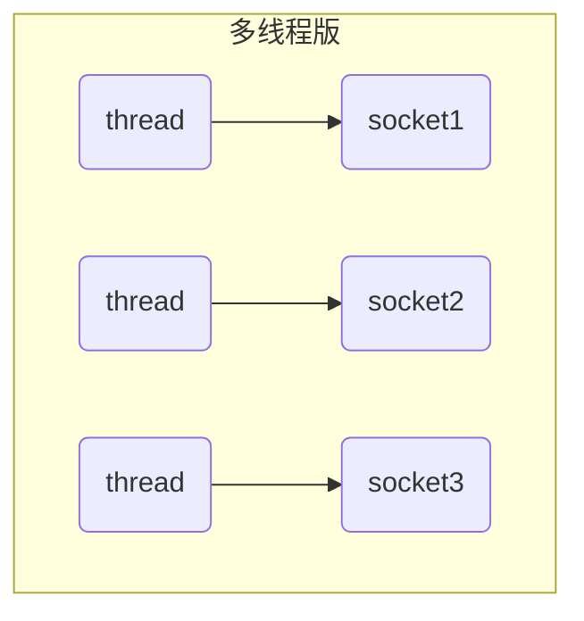
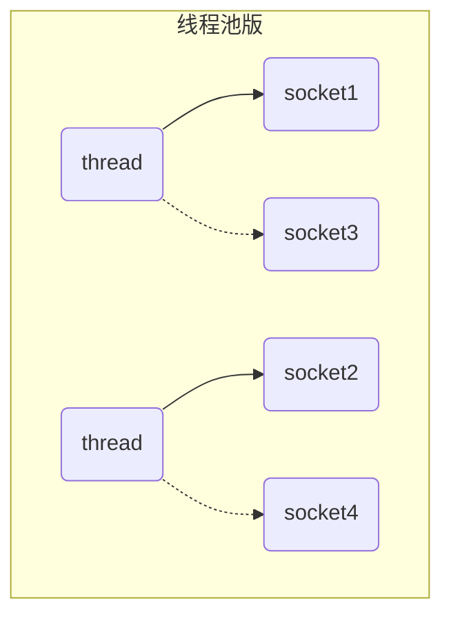
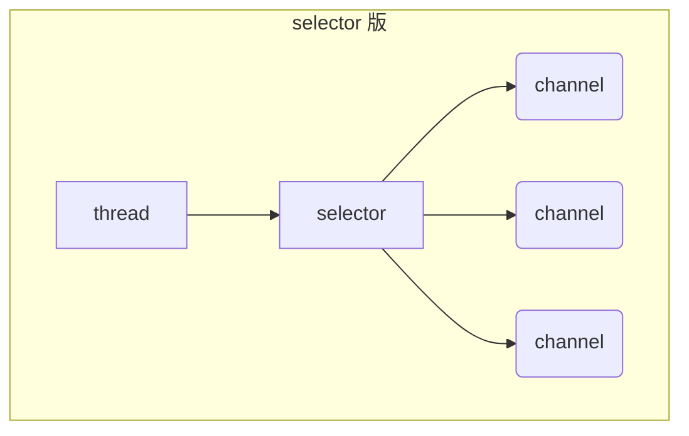

non-blocking io 非阻塞 IO

## 1. 三大组件

### 1.1 Channel & Buffer

channel 有一点类似于 stream，它就是读写数据的**双向通道**，可以从 channel 将数据读入 buffer，也可以将 buffer 的数据写入 channel，而之前的 stream 要么是输入，要么是输出，channel 比 stream 更为底层


**常见的 Channel 有**

* FileChannel
* DatagramChannel
* SocketChannel
* ServerSocketChannel

buffer 则用来缓冲读写数据，**常见的 buffer 有**

* ByteBuffer
  * MappedByteBuffer
  * DirectByteBuffer
  * HeapByteBuffer
* ShortBuffer
* IntBuffer
* LongBuffer
* FloatBuffer
* DoubleBuffer
* CharBuffer

### 1.2 Selector

selector 单从字面意思不好理解，需要结合服务器的设计演化来理解它的用途

#### 多线程版设计



#### ⚠️ 多线程版缺点

* 当线程多起来了，内存占用高
* 线程上下文切换成本高
* 只适合连接数少的场景

#### 线程池版设计



#### ⚠️ 线程池版缺点

* 阻塞模式下，一个线程依旧仅能处理一个 socket 连接
* 仅适合短连接场景，快速断开socket的场景

#### selector 版设计

selector 的作用就是配合一个线程来管理多个 channel，获取这些 channel 上发生的事件，这些 channel 工作在非阻塞模式下，不会让线程吊死在一个 channel 上。适合连接数特别多，但流量低的场景（low traffic）



调用 selector 的 select() 会阻塞直到 channel 发生了读写就绪事件，这些事件发生，select 方法就会返回这些事件交给 thread 来处理

**（把线程thread比作服务员，selector比作监视器来监视每一个被负责的客户需求，channel比作被负责的顾客。）**

## 2. ByteBuffer

准备一个普通文本文件data.txt，内容为

```
1234567890abc
```

使用FileChannel来读取文件内容

```java
@Slf4j
public class TestByteBuffer {

    public static void main(String[] args) {
        //FileChannel
        //1. 输入输出流， 2. RandomAccessFile
        //通过try-with-resource能把对文件资源的释放
        try (FileChannel channel = new FileInputStream("E:\\Java\\ladidol\\ladidol_JavaNote\\Netty\\Netty\\netty-demo\\data.txt").getChannel()) {
            //准备一个缓冲区
            ByteBuffer buffer = ByteBuffer.allocate(10);

//            // 从channel中读取数据， 先向 缓冲区buffer 写入
//            channel.read(buffer);
//            // 打印 buffer 的内容
//            buffer.flip();// 切换至读模式
//
//            while (buffer.hasRemaining()){// 是否有剩余的未读数据
//                byte b = buffer.get();//读一个字节
//                System.out.println((char) b);
//            }
//
//            //这里buffer只有10空间，所以一次读取只会从文件中读取10个字节。

            while (true) {
                // 先向 缓冲区buffer 写入
                int len = channel.read(buffer);
                log.debug("读取到的字节数：{}", len);
                if (len == -1) {//没有内容了
                    break;
                }
                // 切换 buffer 至读模式
                buffer.flip();
                while (buffer.hasRemaining()) {// 是否有剩余的未读数据
                    byte b = buffer.get();//读一个字节
                    log.debug("{}", (char) b);
                }
                //切换 buffer 至写模式
                buffer.clear();
            }


        } catch (IOException e) {
            System.out.println("e = " + e);
        }
    }
}
```

日志输出：

```
[DEBUG] 16:54:19.536 [main] o.c.e.TestByteBuffer - 读取到的字节数：10 
[DEBUG] 16:54:19.546 [main] o.c.e.TestByteBuffer - 1 
[DEBUG] 16:54:19.546 [main] o.c.e.TestByteBuffer - 2 
[DEBUG] 16:54:19.546 [main] o.c.e.TestByteBuffer - 3 
[DEBUG] 16:54:19.546 [main] o.c.e.TestByteBuffer - 4 
[DEBUG] 16:54:19.547 [main] o.c.e.TestByteBuffer - 5 
[DEBUG] 16:54:19.547 [main] o.c.e.TestByteBuffer - 6 
[DEBUG] 16:54:19.547 [main] o.c.e.TestByteBuffer - 7 
[DEBUG] 16:54:19.547 [main] o.c.e.TestByteBuffer - 8 
[DEBUG] 16:54:19.547 [main] o.c.e.TestByteBuffer - 9 
[DEBUG] 16:54:19.547 [main] o.c.e.TestByteBuffer - 0 
[DEBUG] 16:54:19.547 [main] o.c.e.TestByteBuffer - 读取到的字节数：3 
[DEBUG] 16:54:19.547 [main] o.c.e.TestByteBuffer - a 
[DEBUG] 16:54:19.547 [main] o.c.e.TestByteBuffer - b 
[DEBUG] 16:54:19.547 [main] o.c.e.TestByteBuffer - c 
[DEBUG] 16:54:19.547 [main] o.c.e.TestByteBuffer - 读取到的字节数：-1 
```


### 2.1  ByteBuffer 正确使用姿势

1. 向 buffer 写入数据，例如调用 channel.read(buffer)
2. 调用 flip() 切换至**读模式**
3. 从 buffer 读取数据，例如调用 buffer.get()
4. 调用 clear() 或 compact() 切换至**写模式**
5. 重复 1~4 步骤


### 2.2 ByteBuffer 结构

ByteBuffer 有以下重要属性

* capacity
* position
* limit

一开始


写模式下，position 是写入位置，limit 等于容量，下图表示写入了 4 个字节后的状态


flip 动作发生后，position 切换为读取位置，limit 切换为读取限制


读取 4 个字节后，状态


clear 动作发生后，状态


compact 方法，是把未读完的部分向前压缩，然后切换至写模式

> cd未读，就把cd放到前面来，写模式就直接从后面开始写。


#### 💡 调试工具类

```java
package org.cuit.epoch.bytebuffer;

import io.netty.util.internal.StringUtil;

import java.nio.ByteBuffer;

import static io.netty.util.internal.MathUtil.isOutOfBounds;
import static jdk.nashorn.internal.runtime.regexp.joni.encoding.CharacterType.NEWLINE;


/**
 * 作者： ladidol
 * 描述：看一下缓存的状态，缓存以十六进制进行存储。
 */
public class ByteBufferUtil {
    private static final char[] BYTE2CHAR = new char[256];
    private static final char[] HEXDUMP_TABLE = new char[256 * 4];
    private static final String[] HEXPADDING = new String[16];
    private static final String[] HEXDUMP_ROWPREFIXES = new String[65536 >>> 4];
    private static final String[] BYTE2HEX = new String[256];
    private static final String[] BYTEPADDING = new String[16];

    static {
        final char[] DIGITS = "0123456789abcdef".toCharArray();
        for (int i = 0; i < 256; i++) {
            HEXDUMP_TABLE[i << 1] = DIGITS[i >>> 4 & 0x0F];
            HEXDUMP_TABLE[(i << 1) + 1] = DIGITS[i & 0x0F];
        }

        int i;

        // Generate the lookup table for hex dump paddings
        for (i = 0; i < HEXPADDING.length; i++) {
            int padding = HEXPADDING.length - i;
            StringBuilder buf = new StringBuilder(padding * 3);
            for (int j = 0; j < padding; j++) {
                buf.append("   ");
            }
            HEXPADDING[i] = buf.toString();
        }

        // Generate the lookup table for the start-offset header in each row (up to 64KiB).
        for (i = 0; i < HEXDUMP_ROWPREFIXES.length; i++) {
            StringBuilder buf = new StringBuilder(12);
            buf.append(NEWLINE);
            buf.append(Long.toHexString(i << 4 & 0xFFFFFFFFL | 0x100000000L));
            buf.setCharAt(buf.length() - 9, '|');
            buf.append('|');
            HEXDUMP_ROWPREFIXES[i] = buf.toString();
        }

        // Generate the lookup table for byte-to-hex-dump conversion
        for (i = 0; i < BYTE2HEX.length; i++) {
            BYTE2HEX[i] = ' ' + StringUtil.byteToHexStringPadded(i);
        }

        // Generate the lookup table for byte dump paddings
        for (i = 0; i < BYTEPADDING.length; i++) {
            int padding = BYTEPADDING.length - i;
            StringBuilder buf = new StringBuilder(padding);
            for (int j = 0; j < padding; j++) {
                buf.append(' ');
            }
            BYTEPADDING[i] = buf.toString();
        }

        // Generate the lookup table for byte-to-char conversion
        for (i = 0; i < BYTE2CHAR.length; i++) {
            if (i <= 0x1f || i >= 0x7f) {
                BYTE2CHAR[i] = '.';
            } else {
                BYTE2CHAR[i] = (char) i;
            }
        }
    }

    /**
     * 打印所有内容
     * @param buffer
     */
    public static void debugAll(ByteBuffer buffer) {
        int oldlimit = buffer.limit();
        buffer.limit(buffer.capacity());
        StringBuilder origin = new StringBuilder(256);
        appendPrettyHexDump(origin, buffer, 0, buffer.capacity());
        System.out.println("+--------+-------------------- all ------------------------+----------------+");
        System.out.printf("position: [%d], limit: [%d]\n", buffer.position(), oldlimit);
        System.out.println(origin);
        buffer.limit(oldlimit);
    }

    /**
     * 打印可读取内容
     * @param buffer
     */
    public static void debugRead(ByteBuffer buffer) {
        StringBuilder builder = new StringBuilder(256);
        appendPrettyHexDump(builder, buffer, buffer.position(), buffer.limit() - buffer.position());
        System.out.println("+--------+-------------------- read -----------------------+----------------+");
        System.out.printf("position: [%d], limit: [%d]\n", buffer.position(), buffer.limit());
        System.out.println(builder);
    }

    private static void appendPrettyHexDump(StringBuilder dump, ByteBuffer buf, int offset, int length) {
        if (isOutOfBounds(offset, length, buf.capacity())) {
            throw new IndexOutOfBoundsException(
                    "expected: " + "0 <= offset(" + offset + ") <= offset + length(" + length
                            + ") <= " + "buf.capacity(" + buf.capacity() + ')');
        }
        if (length == 0) {
            return;
        }
        dump.append(
                "         +-------------------------------------------------+\n" +
                        NEWLINE + "         |  0  1  2  3  4  5  6  7  8  9  a  b  c  d  e  f |\n" +
                        NEWLINE + "+--------+-------------------------------------------------+----------------+\n");

        final int startIndex = offset;
        final int fullRows = length >>> 4;
        final int remainder = length & 0xF;

        // Dump the rows which have 16 bytes.
        for (int row = 0; row < fullRows; row++) {
            int rowStartIndex = (row << 4) + startIndex;

            // Per-row prefix.
            appendHexDumpRowPrefix(dump, row, rowStartIndex);

            // Hex dump
            int rowEndIndex = rowStartIndex + 16;
            for (int j = rowStartIndex; j < rowEndIndex; j++) {
                dump.append(BYTE2HEX[getUnsignedByte(buf, j)]);
            }
            dump.append(" |");

            // ASCII dump
            for (int j = rowStartIndex; j < rowEndIndex; j++) {
                dump.append(BYTE2CHAR[getUnsignedByte(buf, j)]);
            }
            dump.append('|');
        }

        // Dump the last row which has less than 16 bytes.
        if (remainder != 0) {
            int rowStartIndex = (fullRows << 4) + startIndex;
            appendHexDumpRowPrefix(dump, fullRows, rowStartIndex);

            // Hex dump
            int rowEndIndex = rowStartIndex + remainder;
            for (int j = rowStartIndex; j < rowEndIndex; j++) {
                dump.append(BYTE2HEX[getUnsignedByte(buf, j)]);
            }
            dump.append(HEXPADDING[remainder]);
            dump.append(" |");

            // Ascii dump
            for (int j = rowStartIndex; j < rowEndIndex; j++) {
                dump.append(BYTE2CHAR[getUnsignedByte(buf, j)]);
            }
            dump.append(BYTEPADDING[remainder]);
            dump.append('|');
        }

        dump.append("\n"+NEWLINE +
                "+--------+-------------------------------------------------+----------------+");
    }

    private static void appendHexDumpRowPrefix(StringBuilder dump, int row, int rowStartIndex) {
        if (row < HEXDUMP_ROWPREFIXES.length) {
            dump.append(HEXDUMP_ROWPREFIXES[row]);
        } else {
            dump.append(NEWLINE);
            dump.append(Long.toHexString(rowStartIndex & 0xFFFFFFFFL | 0x100000000L));
            dump.setCharAt(dump.length() - 9, '|');
            dump.append('|');
        }
    }

    public static short getUnsignedByte(ByteBuffer buffer, int index) {
        return (short) (buffer.get(index) & 0xFF);
    }
}
```

示例控制台输出：

```
+--------+-------------------- all ------------------------+----------------+
position: [0], limit: [10]
         +-------------------------------------------------+
0         |  0  1  2  3  4  5  6  7  8  9  a  b  c  d  e  f |
0+--------+-------------------------------------------------+----------------+
0|00000000| 00 00 00 00 00 00 00 00 00 00                   |..........      |
0+--------+-------------------------------------------------+----------------+
```

### 2.3 ByteBuffer 常见方法

#### 分配空间

可以使用 allocate 方法为 ByteBuffer 分配空间，其它 buffer 类也有该方法

```java
Bytebuffer buf = ByteBuffer.allocate(16);
```


#### 向 buffer 写入数据

有两种办法

* 调用 channel 的 read 方法
* 调用 buffer 自己的 put 方法

```java
int readBytes = channel.read(buf);
```

和

```java
buf.put((byte)127);
```


#### 从 buffer 读取数据

同样有两种办法

* 调用 channel 的 write 方法
* 调用 buffer 自己的 get 方法

```java
int writeBytes = channel.write(buf);
```

和

```java
byte b = buf.get();
```

get 方法会让 position 读指针向后走，如果想重复读取数据

* 可以调用 rewind 方法将 position 重新置为 0
* 或者调用 get(int i) 方法获取索引 i 的内容，它不会移动读指针

#### mark 和 reset

mark 是在读取时，做一个标记，即使 position 改变，只要调用 reset 就能回到 mark 的位置

> **注意**
>
> rewind 和 flip 都会清除 mark 位置

详细代码可以看仓库中的代码文件。

#### 字符串与 ByteBuffer 互转

```java
// 1. 字符串转为 ByteBuffer
ByteBuffer buffer = ByteBuffer.allocate(16);
buffer.put("hello ladidol".getBytes());
debugAll(buffer);

// 2. Charset
ByteBuffer hello_ladidol = StandardCharsets.UTF_8.encode("hello ladidol");
debugAll(hello_ladidol);//用这种方法会自动转换成读模式

// 3. wrap
ByteBuffer wrap = ByteBuffer.wrap("hello ladidol".getBytes());
debugAll(wrap);

// buffer to String
String s = StandardCharsets.UTF_8.decode(hello_ladidol).toString();
System.out.println("s = " + s);//注意buffer要切换成读模式。
```

输出：

```
+--------+-------------------- all ------------------------+----------------+
position: [13], limit: [16]
         +-------------------------------------------------+
0         |  0  1  2  3  4  5  6  7  8  9  a  b  c  d  e  f |
0+--------+-------------------------------------------------+----------------+
0|00000000| 68 65 6c 6c 6f 20 6c 61 64 69 64 6f 6c 00 00 00 |hello ladidol...|
0+--------+-------------------------------------------------+----------------+
+--------+-------------------- all ------------------------+----------------+
position: [0], limit: [13]
         +-------------------------------------------------+
0         |  0  1  2  3  4  5  6  7  8  9  a  b  c  d  e  f |
0+--------+-------------------------------------------------+----------------+
0|00000000| 68 65 6c 6c 6f 20 6c 61 64 69 64 6f 6c 00       |hello ladidol.  |
0+--------+-------------------------------------------------+----------------+
+--------+-------------------- all ------------------------+----------------+
position: [0], limit: [13]
         +-------------------------------------------------+
0         |  0  1  2  3  4  5  6  7  8  9  a  b  c  d  e  f |
0+--------+-------------------------------------------------+----------------+
0|00000000| 68 65 6c 6c 6f 20 6c 61 64 69 64 6f 6c          |hello ladidol   |
0+--------+-------------------------------------------------+----------------+
s = hello ladidol
```


#### ⚠️ Buffer 的线程安全

> Buffer 是**非线程安全的**


### 2.4 Scattering Reads

分散读取，有一个文本文件 3parts.txt

```java
public class TestScatteringReads {

    public static void main(String[] args) {
        try (RandomAccessFile file = new RandomAccessFile("E:\\Java\\ladidol\\ladidol_JavaNote\\Netty\\Netty\\netty-demo\\3parts.txt", "rw")) {
            FileChannel channel = file.getChannel();
            ByteBuffer a = ByteBuffer.allocate(3);
            ByteBuffer b = ByteBuffer.allocate(3);
            ByteBuffer c = ByteBuffer.allocate(5);
            channel.read(new ByteBuffer[]{a, b, c});
            a.flip();
            b.flip();
            c.flip();
            debugAll(a);
            debugAll(b);
            debugAll(c);
        } catch (IOException e) {
            e.printStackTrace();
        }
    }

    //+--------+-------------------- all ------------------------+----------------+
    //position: [0], limit: [3]
    //         +-------------------------------------------------+
    //0         |  0  1  2  3  4  5  6  7  8  9  a  b  c  d  e  f |
    //0+--------+-------------------------------------------------+----------------+
    //0|00000000| 6f 6e 65                                        |one             |
    //0+--------+-------------------------------------------------+----------------+
    //+--------+-------------------- all ------------------------+----------------+
    //position: [0], limit: [3]
    //         +-------------------------------------------------+
    //0         |  0  1  2  3  4  5  6  7  8  9  a  b  c  d  e  f |
    //0+--------+-------------------------------------------------+----------------+
    //0|00000000| 74 77 6f                                        |two             |
    //0+--------+-------------------------------------------------+----------------+
    //+--------+-------------------- all ------------------------+----------------+
    //position: [0], limit: [5]
    //         +-------------------------------------------------+
    //0         |  0  1  2  3  4  5  6  7  8  9  a  b  c  d  e  f |
    //0+--------+-------------------------------------------------+----------------+
    //0|00000000| 74 68 72 65 65                                  |three           |
    //0+--------+-------------------------------------------------+----------------+

}
```


### 2.5 Gathering Writes

使用如下方式写入，可以将多个 buffer 的数据填充至 channel


```java
public class TestGatheringReads {
    public static void main(String[] args) {
        try (RandomAccessFile file = new RandomAccessFile("E:\\Java\\ladidol\\ladidol_JavaNote\\Netty\\Netty\\netty-demo\\3parts.txt", "rw")) {
            FileChannel channel = file.getChannel();
            ByteBuffer d = ByteBuffer.allocate(4);
            ByteBuffer e = ByteBuffer.allocate(4);
            channel.position(11);//跳过字符onetwothree

            d.put(new byte[]{'f', 'o', 'u', 'r'});
            e.put(new byte[]{'f', 'i', 'v', 'e'});
            d.flip();//写入文件之前也要flip一下。
            e.flip();
            debugAll(d);
            debugAll(e);
            channel.write(new ByteBuffer[]{d, e});
        } catch (IOException e) {
            e.printStackTrace();
        }
    }
    //+--------+-------------------- all ------------------------+----------------+
    //position: [0], limit: [4]
    //         +-------------------------------------------------+
    //0         |  0  1  2  3  4  5  6  7  8  9  a  b  c  d  e  f |
    //0+--------+-------------------------------------------------+----------------+
    //0|00000000| 66 6f 75 72                                     |four            |
    //0+--------+-------------------------------------------------+----------------+
    //+--------+-------------------- all ------------------------+----------------+
    //position: [0], limit: [4]
    //         +-------------------------------------------------+
    //0         |  0  1  2  3  4  5  6  7  8  9  a  b  c  d  e  f |
    //0+--------+-------------------------------------------------+----------------+
    //0|00000000| 66 69 76 65                                     |five            |
    //0+--------+-------------------------------------------------+----------------+
}
```

### 2.6 练习

网络上有多条数据发送给服务端，数据之间使用 \n 进行分隔
但由于某种原因这些数据在接收时，被进行了重新组合，例如原始数据有3条为

* Hello,world\n
* I'm zhangsan\n
* How are you?\n

变成了下面的两个 byteBuffer (黏包，半包)

* Hello,world\nI'm zhangsan\nHo
* w are you?\n

现在要求你编写程序，将错乱的数据恢复成原始的按 \n 分隔的数据

```java
public static void main(String[] args) {
    ByteBuffer source = ByteBuffer.allocate(64);
    //                     11            24
    source.put("Hello,world\nI'm ladidol\nHo".getBytes());
    split(source);

    source.put("w are you?\nhaha!\n".getBytes());
    split(source);
}

private static void split(ByteBuffer source) {
    source.flip();

    for (int i = 0; i < source.limit(); i++) {
        int oldLimit = source.limit();
        //找到一条完整信息
        if (source.get(i) == '\n') {
            //把这条信息读出来。
            int length = i + 1 - source.position();
            // 存入新的ByteBuffer中去
            ByteBuffer target = ByteBuffer.allocate(length);
            // 从 source 读到 target 中去
            //                for (int j = 0; j < length; j++) {
            //                    target.put(source.get());
            //                }
            source.limit(i + 1);
            target.put(source);
            //limit恢复原样
            source.limit(oldLimit);

            debugAll(target);
        }
    }

    source.compact();//从\n未读位置开始读。
}
```

2022年10月29日20:10:29明天继续